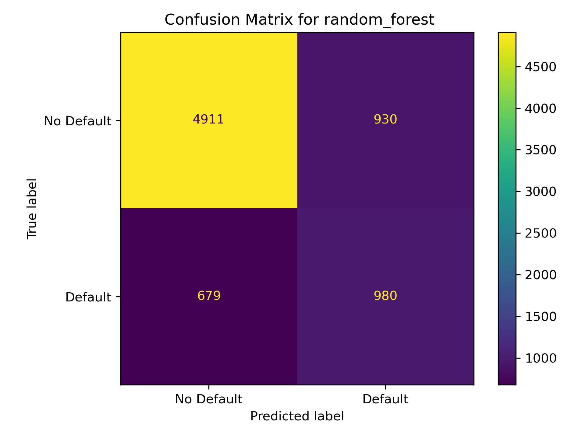
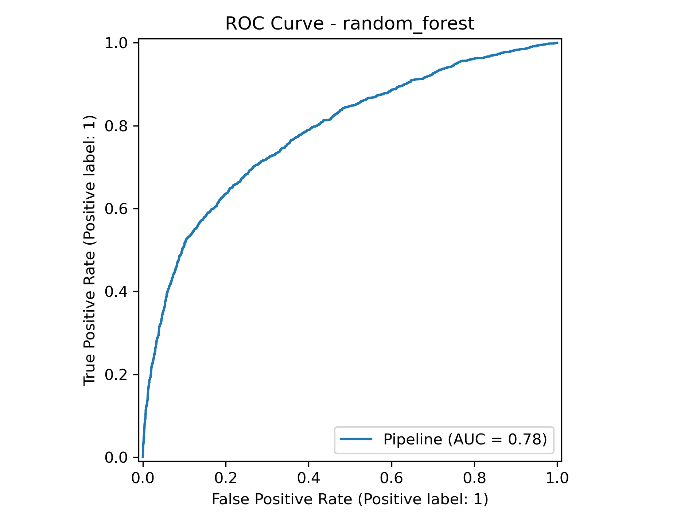
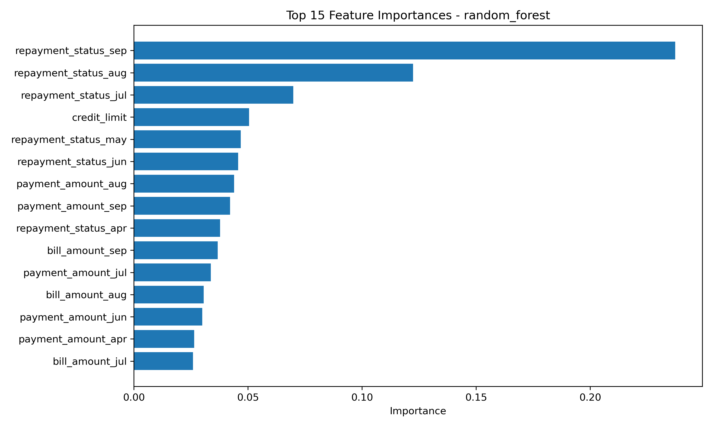

# Credit Default ML Pipeline

An end-to-end machine learning project that predicts whether a credit-card customer will default on their next payment. The repository covers data preprocessing, model comparison, hyperparameter tuning, test-set evaluation, model persistence, visual reporting, and automated tests.

## Project objective

Credit default is an imbalanced binary-classification problem: the positive class represents customers who default, while the negative class represents customers who do not. Accuracy alone can therefore hide poor detection of defaults. This project selects models using the F1 score, which balances precision and recall, and also reports ROC AUC and the individual classification metrics.

The workflow compares five classifiers:

- Dummy classifier as a baseline
- Logistic regression
- Random forest
- Gradient boosting
- XGBoost

## Dataset

The project uses the **Default of Credit Card Clients** dataset. The processed dataset contains 30,000 customer records and 24 columns: 23 predictor columns and the binary target `default_next_month`.

The predictors describe credit limits, customer demographics, monthly repayment status, bill amounts, and payment amounts from April through September. During preprocessing, the original columns are renamed to readable snake-case names and the identifier column `ID` is removed because it is not a predictive customer attribute.

The raw and processed CSV files are intentionally excluded from Git. Place the source file at:

```text
data/raw/default of credit card clients.csv
```

## Pipeline

```text
Raw CSV
  -> clean and rename columns
  -> remove ID
  -> processed CSV
  -> stratified train/test split
  -> five-fold cross-validation
  -> randomized hyperparameter search
  -> select highest-F1 model
  -> test evaluation and saved artifacts
```

The test split is 25%, cross-validation uses five stratified folds, and all randomized operations use seed `999`. Logistic regression and random forest use balanced class weights to reduce the effect of target imbalance. All experiment settings and output paths are centralized in `config/config.yaml`.

## Results

The current generated reports select the tuned random forest as the best model.

| Metric | Test result |
|---|---:|
| Accuracy | 0.7855 |
| Precision | 0.5131 |
| Recall | 0.5907 |
| F1 score | 0.5492 |
| ROC AUC | 0.7847 |

The tuned random forest achieved a mean cross-validation F1 score of **0.5451** with 200 estimators, a maximum depth of 10, a minimum leaf size of 10, a minimum split size of 2, and `log2` feature sampling.

The most influential feature is `repayment_status_sep`, followed by earlier monthly repayment-status variables. This is consistent with recent repayment behaviour carrying substantial information about near-term default risk.

### Model comparison before tuning

| Model | CV accuracy | CV precision | CV recall | CV F1 | CV ROC AUC |
|---|---:|---:|---:|---:|---:|
| Gradient boosting | 0.8200 | 0.6694 | 0.3677 | 0.4746 | 0.7770 |
| Logistic regression | 0.6805 | 0.3724 | 0.6488 | 0.4731 | 0.7237 |
| XGBoost | 0.8097 | 0.6212 | 0.3589 | 0.4547 | 0.7553 |
| Random forest | 0.8117 | 0.6445 | 0.3321 | 0.4382 | 0.7591 |
| Dummy baseline | 0.7788 | 0.0000 | 0.0000 | 0.0000 | 0.5000 |

The untuned logistic model has the highest recall but lower precision. Tuning substantially improves the random forest's balance between those measures, giving it the strongest F1 score.

### Generated visualizations

#### Confusion matrix



#### ROC curve



#### Feature importance



## Repository structure

```text
credit-default-ml-pipeline/
|-- config/config.yaml              # Paths, seeds, model grids, and training options
|-- data/raw/                       # Source dataset (not committed)
|-- data/processed/                 # Cleaned dataset (not committed)
|-- models/best_model.joblib        # Serialized winning pipeline
|-- notebooks/                      # EDA and model experiments
|-- reports/                        # Metrics, plots, and feature importance
|-- src/
|   |-- data_loader.py              # Loading and train/test utilities
|   |-- preprocess.py               # Raw-data cleaning and transformation
|   |-- train.py                    # Training, tuning, evaluation, persistence
|   `-- utils.py                    # Configuration and directory helpers
|-- tests/test_data_loader.py
|-- requirements.txt
`-- README.md
```

## Setup

Python 3.10 or newer is recommended.

### 1. Create and activate a virtual environment

Windows PowerShell:

```powershell
python -m venv .venv
.\.venv\Scripts\Activate.ps1
```

macOS or Linux:

```bash
python3 -m venv .venv
source .venv/bin/activate
```

### 2. Install dependencies

```powershell
python -m pip install -r requirements.txt
```

### 3. Add the dataset

Copy the raw CSV to the path configured under `data.raw_path` in `config/config.yaml`.

## Usage

Run every command from the repository root. The scripts use package imports, so invoke them with Python's `-m` option.

### Preprocess the data

```powershell
python -m src.preprocess
```

This writes the cleaned dataset to `data/processed/credit_default_cleaned.csv`.

### Train and evaluate models

```powershell
python -m src.train
```

Training performs cross-validation for all models, tunes enabled models, evaluates the best tuned model on the held-out test set, and regenerates the artifacts under `models/` and `reports/`. Depending on the computer, randomized searches may take several minutes.

### Run tests

```powershell
python -m pytest -q -p no:cacheprovider tests
```

The cache provider is disabled here because repositories stored in OneDrive can occasionally deny pytest access to temporary cache directories. In a normal local directory, `python -m pytest -q tests` is sufficient.

## Output artifacts

| Artifact | Description |
|---|---|
| `models/best_model.joblib` | Complete fitted pipeline for the selected model |
| `reports/cv_results_before_tuning.csv` | Train and validation metrics for the initial models |
| `reports/tuned_model_results.csv` | Best F1 score and parameters from each randomized search |
| `reports/test_results.csv` | Final held-out test metrics |
| `reports/feature_importance.csv` | Ranked feature importances for compatible tree models |
| `reports/images/confusion_matrix.png` | Test-set confusion matrix |
| `reports/images/roc_curve.png` | Test-set ROC curve |
| `reports/images/feature_importance.png` | Ranked feature-importance chart |

## Configuration

Edit `config/config.yaml` to change input/output paths, the target and test size, random seed, cross-validation, optimization metric, parallelism, enabled models, and randomized-search spaces. Setting a model's `enabled` field to `false` excludes it from hyperparameter tuning. The baseline comparison still builds every model.

## Interpretation and limitations

- The model estimates default risk; it does not establish why an individual customer defaults.
- Performance should be checked for demographic fairness before any real lending use.
- Feature importance is a global summary and should not be interpreted as a causal effect.
- The current evaluation uses one stratified holdout split. External and time-based validation would provide stronger evidence of generalization.
- Threshold selection should reflect the relative business costs of missed defaults and false alerts.
- This is an educational portfolio implementation, not a production credit-decision system.

## Reproducibility

The random seed, split size, folds, model grids, and output paths are version-controlled in `config/config.yaml`. Results can still vary slightly across operating systems or dependency versions because `requirements.txt` does not currently pin exact package versions. Generated CSV reports are the source of record for the latest run.
